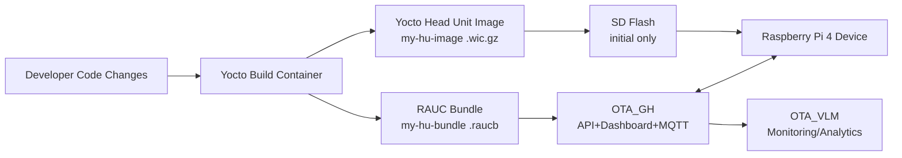
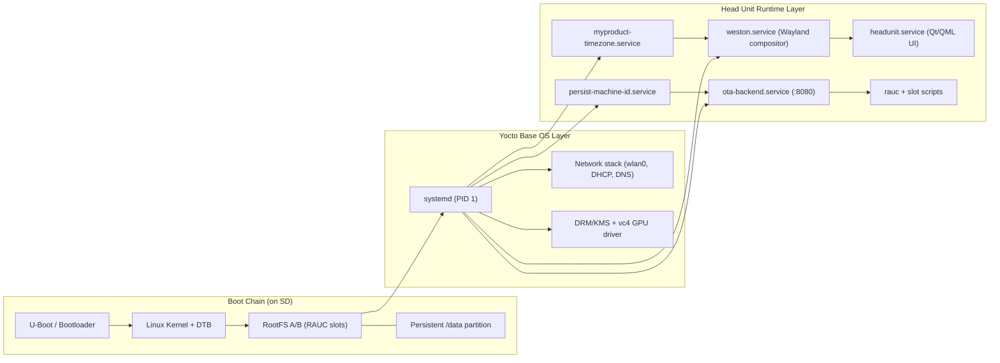
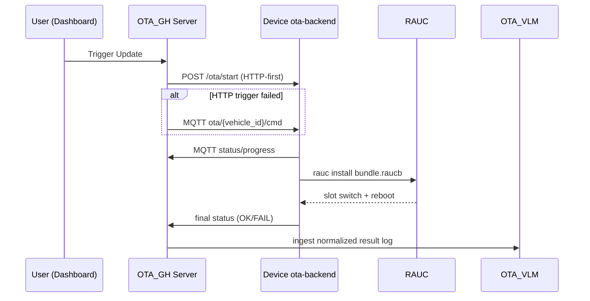
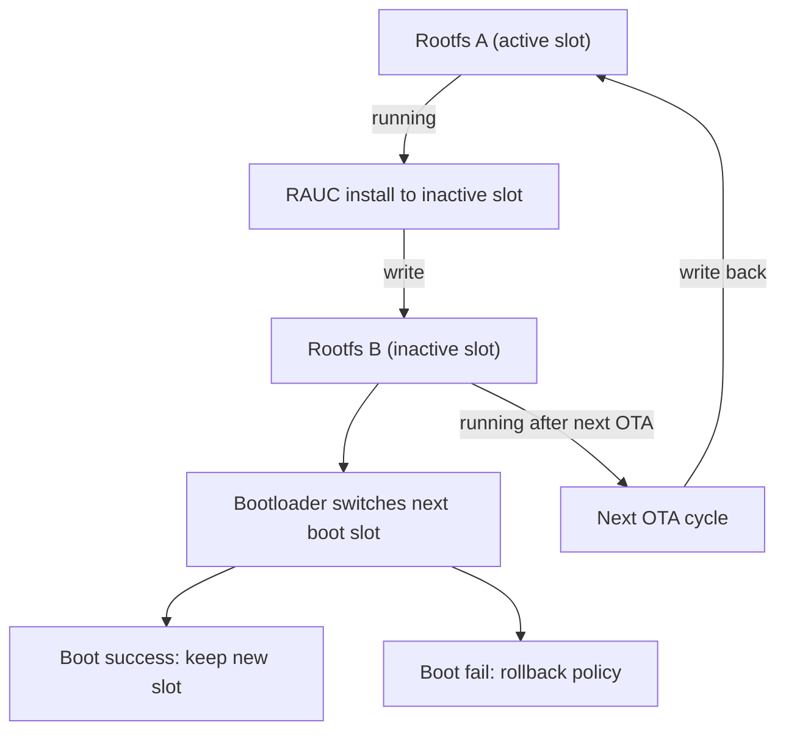

# OTA_HEADUNIT End-to-End Guide

Raspberry Pi 4 기반 IVI Head Unit 프로젝트의 **빌드 → 배포 → OTA 업데이트 → 관제** 전체 실행 가이드임

통합 Docker 스택, 3001 대시보드 기본, RAUC A/B OTA, OTA_GH+OTA_VLM 연동, 로컬 HTTP-first trigger fallback 기준

## Table of Contents
1. [What This Repository Does](#1-what-this-repository-does)
2. [Key Principle: Flash Once, Update by OTA](#2-key-principle-flash-once-update-by-ota)
3. [Project Layout](#3-project-layout)
3.1 [Architecture Overview](#31-architecture-overview)
4. [Prerequisites](#4-prerequisites)
5. [First-Time Setup (From Scratch)](#5-first-time-setup-from-scratch)
6. [Daily OTA Workflow (No SD Mount)](#6-daily-ota-workflow-no-sd-mount)
7. [Unified Stack Operations](#7-unified-stack-operations)
8. [Firmware Management (Upload/Activate/Delete)](#8-firmware-management-uploadactivatedelete)
9. [Monitoring and Log Pipeline (OTA_VLM)](#9-monitoring-and-log-pipeline-ota_vlm)
10. [RPi IP Auto Discovery (Server Side)](#10-rpi-ip-auto-discovery-server-side)
11. [Device Checks and Logs](#11-device-checks-and-logs)
12. [Troubleshooting](#12-troubleshooting)
13. [API Cheat Sheet](#13-api-cheat-sheet)

---

## 1. What This Repository Does

이 저장소는 아래 기능을 통합합니다.

- Yocto 이미지 빌드 (`.wic.gz`)
- RAUC OTA 번들 빌드 (`.raucb`)
- Weston + Qt/QML Head Unit UI 자동 부팅
- 디바이스 OTA 백엔드 (`ota-backend`, 포트 `8080`)
- OTA 업데이트 서버/대시보드 (`OTA_GH`)
- 관제/분석 서버/대시보드 (`OTA_VLM`)
- OTA 성공/실패 로그 스키마 기반 수집 및 분류

중요: 현재 루트 저장소는 **통합 실행/문서 중심 저장소**이며, `OTA_GH/`, `OTA_VLM/`는 각각 독립 개발 이력(.git)을 유지하는 구조입니다.

---

## 2. Key Principle: Flash Once, Update by OTA

핵심 운영 원칙:

- **초기 1회**: SD에 `.wic.gz`를 굽는다.
- **그 이후**: 코드 변경은 `.raucb`를 만들어 OTA로 배포한다.
- 즉, 평소에는 **SD 카드 마운트/수동 복사 없이 OTA**가 기본이다.

예외적으로 SD 직접 수정이 필요한 경우:

- 완전 초기 부팅 불가
- OTA agent/service 자체가 깨져서 OTA 경로가 끊긴 경우
- 긴급 복구 작업

---

## 3. Project Layout

```text
/home/yg/OTA_HEADUNIT
├── ui/qt-headunit/                     # Qt/QML UI
├── services/ota-backend/               # Device-side OTA backend (8080)
├── OTA_GH/                             # OTA server + dashboard + MQTT
├── OTA_VLM/                            # Monitoring server + dashboard
├── tools/                              # Build/stack scripts
├── out/                                # Final artifacts (.wic.gz, .raucb)
├── docker-compose.ota-stack.yml        # Unified OTA_GH + OTA_VLM stack
└── README.md
```

주요 산출물:

- `out/my-hu-image-raspberrypi4-64.rootfs.wic.gz`
- `out/my-hu-bundle-raspberrypi4-64.raucb`

---

## 3.1 Architecture Overview

### 3.1-1 Build/Deploy Architecture



### 3.1-2 Yocto Head Unit Image System Architecture



이미지 내부 기준(디바이스 관점):

- 부팅은 `U-Boot -> Kernel -> rootfs(A/B)` 순서로 시작한다.
- 런타임 핵심은 `systemd`이며, `weston -> headunit(Qt)` 체인으로 화면이 올라온다.
- OTA는 `ota-backend.service`가 `rauc`를 호출해 **inactive slot**에 설치한다.
- `/data` 파티션은 슬롯 전환과 무관하게 유지되어 로그/상태/설정을 보존한다.

### 3.1-3 Runtime OTA Control/Data Flow



### 3.1-4 Device A/B Slot Model



운영 해석:

- 초기 배포는 **Yocto Head Unit Image(`my-hu-image-raspberrypi4-64.rootfs.wic.gz`)** SD flash로 시작한다.
- 운영 업데이트는 `.raucb` OTA만 수행한다(일반적으로 SD 재마운트 불필요).
- 현재 구성은 디바이스 반응성을 위해 **HTTP-first trigger + MQTT fallback** 전략을 사용한다.

---

## 4. Prerequisites

Host(권장):

- Ubuntu 22.04+
- Docker + Docker Compose v2
- RAM 16GB+
- Disk 100GB+

Device:

- Raspberry Pi 4
- SD card
- HDMI display
- Wi-Fi network

선택 도구:

- `jq` (JSON 보기 편함)

```bash
sudo apt-get update
sudo apt-get install -y jq
```

---

## 5. First-Time Setup (From Scratch)

### Step 1) Build Yocto image + RAUC bundle

```bash
cd /home/yg/OTA_HEADUNIT

docker compose run --rm yocto bash -lc '
set -e
./tools/yocto-init.sh
./tools/build-image.sh
./tools/build-rauc-bundle.sh
'
```

결과 확인:

```bash
ls -lh out/my-hu-image-raspberrypi4-64.rootfs.wic.gz
ls -lh out/my-hu-bundle-raspberrypi4-64.raucb
```

### Step 2) Flash SD (initial only)

`/dev/sdX`를 실제 SD 디바이스로 바꿔서 실행:

```bash
zcat /home/yg/OTA_HEADUNIT/out/my-hu-image-raspberrypi4-64.rootfs.wic.gz \
  | sudo dd of=/dev/sdX bs=4M status=progress conv=fsync
sync
```

### Step 3) Boot device and verify core services

Raspberry Pi에서:

```bash
systemctl --no-pager -l status weston headunit ota-backend
curl -sS http://127.0.0.1:8080/health
curl -sS http://127.0.0.1:8080/ota/status
```

정상 기준:

- `weston/headunit/ota-backend`: `active`
- `/health`: `ok: true`

### Step 4) Start unified server stack on host

```bash
cd /home/yg/OTA_HEADUNIT
./tools/ota-stack-up.sh
```

이 스크립트는 자동으로:

- OTA_GH + OTA_VLM 모두 기동
- 대시보드 포트 기본 `3001`
- `OTA_GH_FIRMWARE_BASE_URL`을 호스트 IP 기준으로 자동 설정/저장
  - 저장 위치: `/home/yg/OTA_HEADUNIT/.env`
  - 예: `http://192.168.86.30:8080`
- 로컬 장치 직접 트리거 매핑 기본값 적용
  - `OTA_GH_LOCAL_DEVICE_MAP=vw-ivi-0026@192.168.86.250:8080`

접속:

- OTA dashboard (operations+monitoring): `http://localhost:3001`
- OTA API: `http://localhost:8080`
- Monitoring frontend: `http://localhost:5173`
- Monitoring backend: `http://localhost:4000`

---

## 6. Daily OTA Workflow (No SD Mount)

이 단계가 평소 반복 루틴입니다.

### 6-1) Code change 후 bundle 재빌드

```bash
cd /home/yg/OTA_HEADUNIT

docker compose run --rm yocto bash -lc '
set -e
./tools/yocto-init.sh
./tools/build-image.sh
./tools/build-rauc-bundle.sh
'
```

> 운영상 OTA만 필요해도, 현재 프로젝트 기본 흐름은 `build-image + build-rauc-bundle` 순서를 권장합니다.

### 6-2) Firmware 업로드 (active 등록)

```bash
curl -X POST http://localhost:8080/api/v1/admin/firmware \
  -F "file=@/home/yg/OTA_HEADUNIT/out/my-hu-bundle-raspberrypi4-64.raucb" \
  -F "version=1.3.9" \
  -F "release_notes=your release note" \
  -F "overwrite=true"
```

### 6-3) Dashboard에서 차량 선택 후 Update

- `http://localhost:3001`
- Firmware 목록에서 원하는 버전 선택
- Vehicle 행의 `Update` 버튼 실행

또는 API로 직접:

```bash
curl -X POST http://localhost:8080/api/v1/admin/trigger-update \
  -H "Content-Type: application/json" \
  -d '{"vehicle_id":"vw-ivi-0026"}'
```

현재 trigger 동작 우선순위:

1. 로컬 HTTP trigger (`POST http://192.168.86.250:8080/ota/start`)
2. 실패 시 MQTT topic fallback (`ota/vw-ivi-0026/cmd`)

즉, MQTT가 잠시 불안정해도 디바이스 반응 가능성을 높인 상태입니다.

특정 버전 강제:

```bash
curl -X POST http://localhost:8080/api/v1/admin/trigger-update \
  -H "Content-Type: application/json" \
  -d '{"vehicle_id":"vw-ivi-0026", "version":"1.3.8", "force":true}'
```

### 6-4) 진행 상태 확인

```bash
curl -sS http://localhost:8080/api/v1/vehicles | jq .
docker logs ota_headunit-ota_gh_server-1 --tail 200
```

디바이스에서:

```bash
tail -n 200 /data/log/ui/ota-backend-requests.log
rauc status --output-format=json
```

---

## 7. Unified Stack Operations

### Start

```bash
cd /home/yg/OTA_HEADUNIT
./tools/ota-stack-up.sh
```

### Stop

```bash
cd /home/yg/OTA_HEADUNIT
./tools/ota-stack-down.sh
```

### Status

```bash
docker compose -f /home/yg/OTA_HEADUNIT/docker-compose.ota-stack.yml ps
```

### Follow logs

```bash
docker compose -f /home/yg/OTA_HEADUNIT/docker-compose.ota-stack.yml logs -f ota_gh_server ota_vlm_backend ota_gh_mosquitto
```

### MQTT over WebSocket (Method 3, Cloudflare-friendly)

목표:

- Dashboard/API/firmware는 HTTPS tunnel로 공개
- MQTT는 WebSocket(`ws`/`wss`) transport로 동일 브로커 사용

서버(OTA_GH) 설정 예시 (`/home/yg/OTA_HEADUNIT/.env`):

```bash
OTA_GH_MQTT_TRANSPORT=websockets
OTA_GH_MQTT_WS_PATH=/mqtt
OTA_GH_MQTT_TLS_ENABLED=false
OTA_GH_MQTT_TLS_INSECURE=false
```

디바이스(ota-backend `config.json`) 설정 예시:

```json
{
  "mqtt_enabled": true,
  "mqtt_broker_host": "mqtt.example.com",
  "mqtt_broker_port": 443,
  "mqtt_transport": "websockets",
  "mqtt_ws_path": "/mqtt",
  "mqtt_tls": true,
  "mqtt_tls_insecure": false
}
```

Cloudflare tunnel ingress 예시:

```yaml
ingress:
  - hostname: dash.example.com
    service: http://localhost:3001
  - hostname: ota.example.com
    service: http://localhost:8080
  - hostname: mqtt.example.com
    service: http://localhost:9001
  - service: http_status:404
```

적용 후 재기동:

```bash
cd /home/yg/OTA_HEADUNIT
./tools/ota-stack-up.sh
```

상태 확인:

```bash
curl -sS http://localhost:8080/health
```

헬스 응답에 `mqtt_transport`, `mqtt_ws_path`, `mqtt_tls_enabled` 필드가 표시됩니다.

---

## 8. Firmware Management (Upload/Activate/Delete)

### Where firmware files are stored

업로드된 실제 파일 경로(호스트):

- `/home/yg/OTA_HEADUNIT/OTA_GH/firmware_files`

서버 컨테이너 내부:

- `/app/firmware_files`

### List firmware

```bash
curl -sS http://localhost:8080/api/v1/firmware | jq .
curl -sS http://localhost:8080/api/v1/firmware?active_only=true | jq .
```

### Activate a specific firmware

```bash
curl -X POST http://localhost:8080/api/v1/admin/firmware/activate \
  -H "Content-Type: application/json" \
  -d '{"version":"1.3.9"}'
```

### Delete firmware by id

```bash
curl -X DELETE http://localhost:8080/api/v1/admin/firmware/18
```

---

## 9. Monitoring and Log Pipeline (OTA_VLM)

현재 구성:

- OTA_GH server가 OTA 결과를 OTA_VLM backend `/ingest`로 전달
- OTA_VLM이 DB + case 파일(`SUCCESS`/`FAIL` 분류)에 저장

주요 경로(호스트):

- `/home/yg/OTA_HEADUNIT/OTA_VLM/failed case/SUCCESS`
- `/home/yg/OTA_HEADUNIT/OTA_VLM/failed case/<FAIL_CASE_NAME>`

요약 확인:

```bash
curl -sS http://localhost:4000/health
curl -sS http://localhost:4000/stats/summary | jq .
```

대시보드:

- 통합 대시보드 Monitoring 탭: `http://localhost:3001`
- OTA_VLM 프론트 단독: `http://localhost:5173`

---

## 10. RPi IP Auto Discovery (Server Side)

라즈베리 IP가 자주 바뀌는 환경을 위해 자동 탐지 스크립트를 추가했습니다.

기본값(현재 환경):

- `RPI_DEFAULT_IP=192.168.86.250`

사용:

```bash
cd /home/yg/OTA_HEADUNIT
./tools/find-rpi-ip.sh
./tools/find-rpi-ip.sh --with-source
```

필요 시 기본값 변경:

```bash
RPI_DEFAULT_IP=192.168.86.250 ./tools/find-rpi-ip.sh
RPI_SUBNET_PREFIX=192.168.86 ./tools/find-rpi-ip.sh
```

탐지 우선순위:

1. `RPI_DEFAULT_IP`(기본: `192.168.86.250`)
2. `raspberrypi4-64.local`
3. OTA 서버 로그(최근 `/firmware`/`/ingest` 요청 IP)
4. `ip neigh` 서브넷 스캔

---

## 11. Device Checks and Logs

디바이스 상태 API:

```bash
curl -sS http://127.0.0.1:8080/health
curl -sS http://127.0.0.1:8080/ota/status | jq .
```

RAUC/slot 확인:

```bash
rauc status --output-format=json
cat /proc/cmdline
```

시간/타임존 확인:

```bash
date
readlink -f /etc/localtime
```

주요 로그:

- `/data/log/ui/weston.log`
- `/data/log/ui/weston-err.log`
- `/data/log/ui/headunit-journal.log`
- `/data/log/ui/ota-backend-service.log`
- `/data/log/ui/ota-backend-requests.log`

---

## 12. Troubleshooting

### 12-1) "업데이트 눌렀는데 반응 없음"

가장 흔한 원인:

- OTA 서버가 펌웨어 URL을 `localhost`로 계산함
- 라즈베리 입장에서는 자기 자신(`localhost`)을 보게 되어 다운로드 실패

확인:

```bash
curl -sS -X POST http://localhost:8080/api/v1/admin/trigger-update \
  -H "Content-Type: application/json" \
  -d '{"vehicle_id":"vw-ivi-0026"}'
```

응답에 아래가 보이면 해당 문제:

- `error: Firmware URL resolves to localhost`

해결:

- 반드시 `./tools/ota-stack-up.sh`로 스택을 기동
- 또는 `OTA_GH_FIRMWARE_BASE_URL=http://<HOST_IP>:8080` 설정 후 서버 재시작

### 12-6) Dashboard에서는 전송 성공인데 라즈베리에서 반응 없음

증상:

- 대시보드: update sent/success
- 라즈베리: 다운로드/적용 로그 없음

원인(가장 빈번):

- 라즈베리 `ota-backend`의 `mqtt_broker_host`가 현재 서버 IP와 다름
  - 예: 실제 서버는 `192.168.86.30`인데 디바이스는 `192.168.86.29`를 바라봄

즉시 확인:

```bash
ssh root@192.168.86.250 "curl -sS http://127.0.0.1:8080/health"
```

`"mqtt_connected": false`면 broker 경로 불일치 가능성이 큼.

즉시 수정:

```bash
ssh root@192.168.86.250 "python3 - <<'PY'
import json
from urllib.parse import urlparse, urlunparse
path='/data/etc/ota-backend/config.json'
with open(path,'r',encoding='utf-8') as f:
    cfg=json.load(f)
server_ip='192.168.86.30'  # 현재 OTA 서버 호스트 IP로 변경
cfg['mqtt_broker_host']=server_ip
cfg['mqtt_broker_port']=1883
raw=str(cfg.get('collector_url','')).strip()
if raw:
    p=urlparse(raw); scheme=p.scheme or 'http'; port=p.port or 8080
    cfg['collector_url']=urlunparse((scheme,f'{server_ip}:{port}','/ingest','','',''))
else:
    cfg['collector_url']=f'http://{server_ip}:8080/ingest'
with open(path,'w',encoding='utf-8') as f:
    json.dump(cfg,f,ensure_ascii=False,indent=2)
print('updated')
PY
systemctl restart ota-backend
curl -sS http://127.0.0.1:8080/health"
```

정상 기준:

- `"mqtt_connected": true`
- `/data/log/ui/ota-backend-requests.log`에 `mqtt connected sub=ota/vw-ivi-0026/cmd` 확인

### 12-2) 차량이 offline으로 보임

- `vehicle_id` 불일치 가능성 확인
  - 디바이스 `/etc/ota-backend/config.json`의 `device_id`
  - 대시보드 vehicle_id
- 재부팅 직후 heartbeat가 다시 들어오기까지 1~3분 걸릴 수 있음

### 12-3) OTA Status에 target version이 안 보임

- 최신 코드 기준 UI/백엔드는 `current -> target` 표시 로직 반영됨
- 구버전 이미지면 해당 로직 미반영일 수 있으므로 최신 `.raucb`로 업데이트 필요

### 12-4) Vite ENOSPC (watcher limit)

```bash
sudo sysctl fs.inotify.max_user_watches=524288
sudo sysctl fs.inotify.max_user_instances=1024
```

### 12-5) SSH host key changed

```bash
RPI_IP=$(./tools/find-rpi-ip.sh)
ssh-keygen -f /home/yg/.ssh/known_hosts -R "${RPI_IP}"
ssh root@"${RPI_IP}"
```

---

## 13. API Cheat Sheet

### Server health

```bash
curl -sS http://localhost:8080/health
```

### Vehicles

```bash
curl -sS http://localhost:8080/api/v1/vehicles
curl -sS http://localhost:8080/api/v1/vehicles/vw-ivi-0026
```

### Firmware

```bash
curl -sS http://localhost:8080/api/v1/firmware
curl -sS http://localhost:8080/api/v1/firmware?active_only=true
```

### Upload firmware

```bash
curl -X POST http://localhost:8080/api/v1/admin/firmware \
  -F "file=@/home/yg/OTA_HEADUNIT/out/my-hu-bundle-raspberrypi4-64.raucb" \
  -F "version=1.3.9" \
  -F "release_notes=release" \
  -F "overwrite=true"
```

### Activate firmware

```bash
curl -X POST http://localhost:8080/api/v1/admin/firmware/activate \
  -H "Content-Type: application/json" \
  -d '{"version":"1.3.9"}'
```

### Delete firmware

```bash
curl -X DELETE http://localhost:8080/api/v1/admin/firmware/18
```

### Trigger update

```bash
curl -X POST http://localhost:8080/api/v1/admin/trigger-update \
  -H "Content-Type: application/json" \
  -d '{"vehicle_id":"vw-ivi-0026"}'
```

### Trigger specific version / force mode

```bash
curl -X POST http://localhost:8080/api/v1/admin/trigger-update \
  -H "Content-Type: application/json" \
  -d '{"vehicle_id":"vw-ivi-0026", "version":"1.3.8", "force":true}'
```

---

## Final Checklist

1. `out/`에 최신 `.wic.gz`, `.raucb`가 생성됨
2. 장치에서 `weston/headunit/ota-backend`가 active
3. 통합 스택이 정상(`8080`, `3001`, `4000`, `5173`)
4. Active firmware 1개 확인
5. Update trigger 후 `GET /firmware/*.raucb 200` 로그 확인
6. 장치 재부팅 후 heartbeat 재수신 확인
7. OTA_VLM 통계/로그 반영 확인
